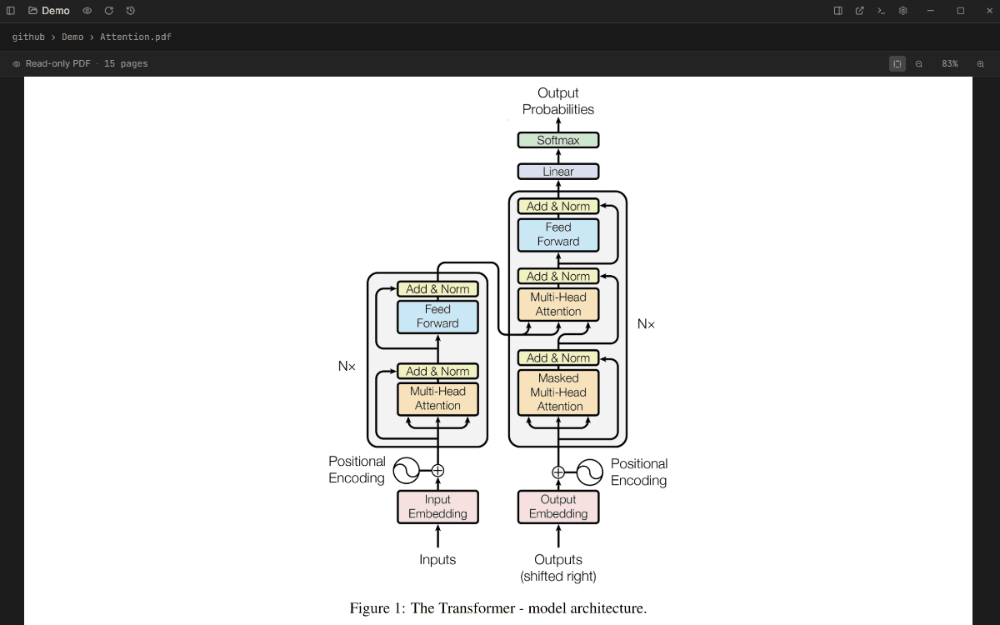
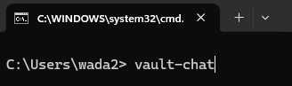

# vault-chat

A desktop app for your markdown notes with Claude (or GPT, or Gemini, or any OpenRouter model) wired into the editor, the PDF viewer, and the chat. Heavily inspired by Obsidian (any folder is a vault), Cursor (inline edit on selections), and Claude Code (a real local-file agent with Read / Write / Bash). Drag a box on any PDF and ask about the region — it sends the pixels, not just text, so math / handwriting / diagrams actually work.



## Getting started

This is a source-first project. You clone the repo, install the prereqs once, and launch it from your terminal.

### 1. Install prerequisites (one-time)

#### macOS

```sh
# Homebrew (skip if you already have it)
/bin/bash -c "$(curl -fsSL https://raw.githubusercontent.com/Homebrew/install/HEAD/install.sh)"

xcode-select --install            # git + cc (skip if already installed)
brew install node rustup-init
rustup-init -y
```

~5 min total. npm ships with Node — no separate install.

#### Linux (Debian / Ubuntu)

```sh
# Build tools + Tauri deps
sudo apt update
sudo apt install -y build-essential curl git libssl-dev libgtk-3-dev \
  libayatana-appindicator3-dev librsvg2-dev libwebkit2gtk-4.1-dev

# Node 20 via NodeSource
curl -fsSL https://deb.nodesource.com/setup_20.x | sudo -E bash -
sudo apt install -y nodejs

# Rust
curl --proto '=https' --tlsv1.2 -sSf https://sh.rustup.rs | sh
```

~5 min total. npm ships with Node — no separate install.

#### Windows

**Terminal path** (Windows 11 or any recent Win 10 with winget):

```powershell
winget install OpenJS.NodeJS.LTS
winget install Rustlang.Rustup
# Then run rustup from a fresh shell and accept defaults (installs MSVC build tools, ~1.5 GB)
rustup-init
```

**GUI path** (older Windows without winget):

1. Install [Node 20+](https://nodejs.org/).
2. Install [Rust via rustup](https://rustup.rs/). Accept defaults — installs MSVC build tools.

WebView2 ships with Windows 10/11 — nothing to install either way.

~20 min total, mostly the MSVC download. npm ships with Node — no separate install.

### 2. Clone + install + register the command

```sh
git clone https://github.com/carlwilsn/vault-chat
cd vault-chat
npm install
npm link
```

~1 min. `npm link` puts `vault-chat` on your `PATH` via npm's global bin folder, so the command works from any terminal. Unlink later with `npm unlink -g vault-chat`.

> **Don't move the cloned folder after this step.** `npm link` points the global `vault-chat` command back at `bin/vault-chat.js` inside this folder — move it and the command breaks. If you need to relocate it, `npm unlink -g vault-chat`, move the folder, `cd` in, and re-run `npm link`.

### 3. Launch

Just type `vault-chat` anywhere from your terminal and the app will open.



The launcher just runs `npm run tauri dev` in the foreground under a shorter name — you'll see cargo's output live. **First run takes ~10–15 min** while Rust compiles everything; subsequent runs are ~2 seconds because cargo caches incrementally.

When the app opens: hit the gear icon → paste an API key (Anthropic, OpenAI, Google, or OpenRouter) → open a folder as your vault → start asking.

### Try it free (no credit card)

You don't need to spend a cent to try the app — Google's Gemini API has a generous free tier that's enough to kick the tires.

1. Go to [aistudio.google.com/apikey](https://aistudio.google.com/apikey), sign in with a Google account, click **Create API key**, copy the value.
2. In vault-chat: gear icon → paste it into the **Google** field → **Save**.
3. In the model dropdown (top of the chat pane) pick a Gemini model — `gemini-2.5-flash` is fine for everyday use.
4. Open any folder as a vault and start chatting.

That's it — Read / Write / Edit / Bash / PDF marquee / inline edit all work on the free tier. Anthropic and OpenAI require prepaid credits and are worth adding once you know you like the app; the same gear-icon flow applies.

**Optional: WebSearch.** The agent's `WebSearch` tool is powered by [Tavily](https://app.tavily.com/), which also has a free tier (1000 searches/month). Grab a key from your Tavily dashboard, then in vault-chat: gear icon → **Tavily (web search)** field → paste → **Save**. `WebFetch` (loading a specific URL) needs no key and works out of the box.

## What's in it

- **Ctrl+K inline edit** on any paragraph or code selection. `Ctrl+L` for an ask mode that answers in the same popover without touching the file.
- **PDF marquee** — drag a rectangle over any region of a PDF. Selected text + the pixel screenshot go to the model together. Works on math, tables, scanned pages, handwriting.
- **Model-agnostic**. Anthropic, OpenAI, Google, or OpenRouter (one key, hundreds of models). Swap mid-session via the settings dropdown.
- **Git-backed**. Every agent turn that touches files auto-commits. `Ctrl+H` opens a history modal with per-file timeline + one-click restore to any earlier commit. Vault never loses state.
- **Phone bridge**. Run the desktop app on your laptop, talk to it from your phone over Tailscale — voice in, agent answer back, with its own conversation thread separate from whatever you've got on screen.
- **`Alt+L`** flips the whole UI between light and dark.
- **Editable everywhere** — explained below. The agent can write its own skills and tools right inside the meta vault.

## The editable surfaces

vault-chat treats every folder as a vault. Two are worth knowing about:

| Surface | Where | What's there | Switch from |
|---|---|---|---|
| **User vault** | any folder you pick | your notes | titlebar → folder icon |
| **Meta vault** | `%APPDATA%/com.vault-chat.app/meta/` (Windows) — same pattern Mac/Linux | `system.md`, `skills/`, `tools/` | settings → "Open meta vault" |

Each is git-versioned with auto-commit. The titlebar shows a chip when you're in the meta vault so you never forget where you are.

### Creating new skills

Ask the agent: *"Make me a skill for reviewing math HW."* It writes `<meta>/skills/review-hw/SKILL.md` with YAML front-matter. Next turn the skill is invokable as `/review-hw` in chat.

### Creating new tools

Ask: *"Build me a tool that fetches the Champions League standings."* The agent writes `<meta>/tools/champions-league/TOOL.md` (JSON Schema input spec) + `run.py` (reads stdin JSON, prints stdout JSON). Available on the next turn.

## Security

API keys live in the OS keychain (Windows Credential Manager / Mac Keychain / Linux libsecret), not in localStorage or plaintext files. The agent's file-operation tools (`Read`, `Write`, `Bash`, etc.) cannot reach them.

The agent cannot modify files inside any `.git/` directory — the file-op tools refuse those paths so the undo system stays intact.

## Got an idea for the app?

Reach out to me (Carl) at [carlwilson2027@u.northwestern.edu](mailto:carlwilson2027@u.northwestern.edu). I'll help you cleanly clone the repo so you can make your own version — either with Claude Code driving the changes or by hand if you'd rather code it yourself.

## License

MIT. See [LICENSE](./LICENSE).
